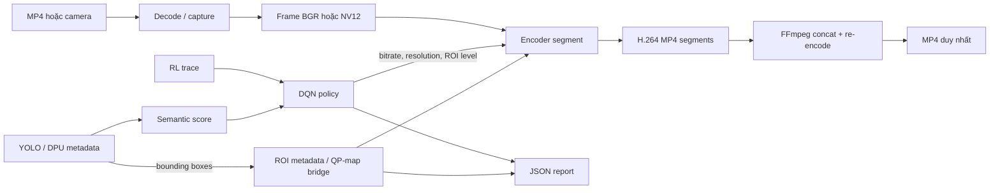

# Pipeline architecture

## Mục tiêu

Pipeline kết hợp giải mã video, metadata nhận diện đối tượng, policy DQN và bộ
mã hóa H.264. Backend `sim` chạy trên PC để kiểm tra luồng điều khiển; backend
`zcu106` cung cấp ranh giới tích hợp cho DPU và VCU trên bo mạch.

## Kiến trúc tổng thể



## Backend PC (`--backend sim`)

1. `filesrc`, `decodebin` và `videoconvert` của GStreamer giải mã MP4 thành
   frame BGR; `appsink` chuyển frame sang Python.
2. `VCUSimEnv` đọc `rl_states.jsonl`. DQN chọn action an toàn gồm tỷ lệ bitrate,
   mức phân giải và mức ROI.
3. Detection trong `yolo_metadata.jsonl` được hợp nhất thành một bounding box.
   Runner gắn `GstVideoRegionOfInterestMeta` lên buffer khi action bật ROI.
4. Mỗi khi action thay đổi, runner đóng segment hiện tại và tạo pipeline
   `appsrc -> videoconvert -> videoscale -> x264enc -> h264parse -> mp4mux` mới.
   Việc tạo segment mới đảm bảo cấu hình bitrate/phân giải có hiệu lực đúng tại
   ranh giới action.
5. Tất cả segment được chuẩn hóa về `--width` × `--height`. Nếu có nhiều hơn
   một segment, FFmpeg đọc danh sách `segments.ffconcat`, giải mã và tái mã hóa
   toàn bộ thành một MP4 tại `--out`. Tái mã hóa được dùng thay cho stream-copy
   để chuẩn hóa timestamp và parameter set.
6. Report JSON lưu output cuối, danh sách segment và quyết định theo từng frame.

`x264enc` không sử dụng generic ROI metadata để điều khiển QP. Vì vậy ROI trên
PC là hợp đồng metadata có thể quan sát và kiểm thử, không phải phép đo chất
lượng ROI của VCU phần cứng.

## Backend ZCU106 (`--backend zcu106`)

```text
                         /-> vvas_xinfer -> semantic_roi_bridge -> fakesink
v4l2src -> tee --------<                    (publish action by frame PTS)
                         \-> semantic_roi_apply -> vvas_xvcuenc -> H.264/RTP
                             (consume action by frame PTS)
```

- Nhánh điều khiển chạy `vvas_xinfer` trên DPU. `semantic_roi_bridge` tính
  semantic score, gọi DQN và công bố action theo PTS của frame; `fakesink` chỉ
  kết thúc nhánh sau khi metadata đã được xử lý.
- Nhánh mã hóa giữ đường video độc lập. `semantic_roi_apply` lấy đúng action
  theo PTS, cập nhật bitrate/resolution và chuyển bounding box cùng ROI qoffset
  sang ROI/QP-map metadata của VCU.
- `vvas_xvcuenc` mã hóa H.264 bằng phần cứng; tên element và property phải được
  xác nhận bằng `gst-inspect-1.0` trên đúng Vitis/VVAS image.

Backend ZCU106 hiện chỉ in template tích hợp. Nó không giả định plugin VVAS của
một phiên bản BSP cụ thể đã tồn tại trên máy PC. Hai adapter phải đồng bộ bằng
PTS và có chính sách timeout/drop rõ ràng để nhánh DPU chậm không làm sai action
của frame ở nhánh encoder.

## Artefact đầu ra

Với `--out outputs/yolov5_results/gst_policy.mp4`, runner tạo:

- `gst_policy.mp4`: video cuối cùng, luôn được tạo khi có ít nhất một frame;
- `gst_policy_gst_segments/segment_XXXX.mp4`: segment theo ranh giới action;
- `gst_policy_gst_segments/manifest.json`: danh sách segment dùng để audit;
- `gst_policy_gst_segments/segments.ffconcat`: input nội bộ cho FFmpeg;
- `gstreamer_rl_report.json`: action, bitrate, semantic score và ROI từng frame.

Pipeline hiện không giữ audio. Nhánh decode/encode chỉ xử lý video và bước ghép
FFmpeg dùng `-an` để đầu ra phản ánh rõ giới hạn này.

## Luồng lỗi và tính toàn vẹn

- Không có frame: runner dừng và không báo thành công.
- Thiếu GStreamer/PyGObject/x264enc: pipeline thất bại trước khi encode.
- Thiếu FFmpeg khi có nhiều segment: runner báo cách dùng `--ffmpeg-bin`.
- FFmpeg trả lỗi hoặc tạo file rỗng: runner ném lỗi và không in `[done]`.
- Segment và report được giữ lại để điều tra khi bước ghép thất bại.

## Ví dụ chạy

```bash
python3 gstreamer_edge_pipeline.py --backend sim \
  --input dataset/videos/Vehicle-Dataset-Sample-2_720p.mp4 \
  --policy rl_env_offline/dqn_policy.pt --max-frames 120 \
  --out outputs/yolov5_results/gst_policy.mp4 \
  --report outputs/metadata/gstreamer_rl_report.json
```

Nếu FFmpeg không nằm trong `PATH`:

```bash
python3 gstreamer_edge_pipeline.py --backend sim \
  --input dataset/videos/Vehicle-Dataset-Sample-2_720p.mp4 \
  --ffmpeg-bin ffmpeg-7.0.2-amd64-static/ffmpeg
```
